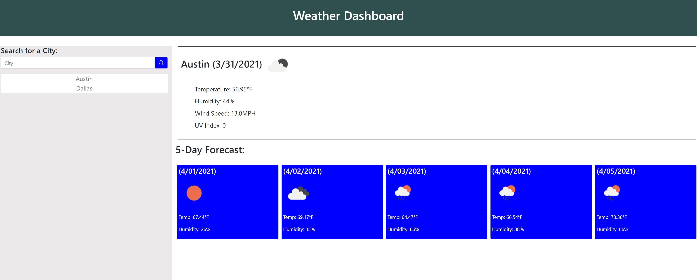

# TheWeatherOutsideIsWeather

# Overview

This program is a simple weather forecast by city search page. 

Upon entering the city name into the search bar and hitting the search button the following data displays:

    -City Name.
    -Today's Date.
    -Current forecast icon.
    -Current temperature, humidity percent, wind speed and uv index.
    -If the UV index is too high it is displayed in red.
    -5 Day Forecast.

    -City Name is appended to search history.
    -Any city name listd in search history is clickable which then displays weather info for that city.

# Usage
All you need to use the weather forecast is internet access and a web browser!
Follow this link (https://mcm1015.github.io/TheWeatherOutsideIsWeather/.)

Website Preview: 

If you want to view the working code follow this link [HTML CODE](index.html), [JavaScript](./assets/js/script.js) and this link [CSS CODE](./assets/css/style.css)

# Credits
https://getbootstrap.com/docs/5.0/getting-started/introduction/

https://stackoverflow.com/questions/20791533/search-history-with-localstorage-variable-in-html

# License

The [MIT](LICENSE) license was chosen for this project. 